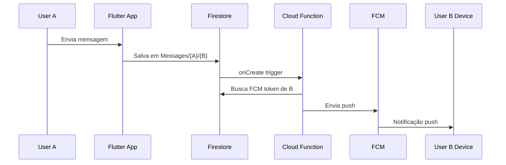
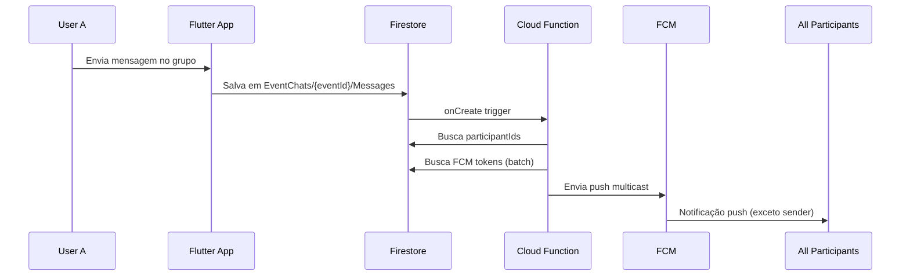

# Chat Push Notifications

## 📱 Visão Geral

Sistema de **push notifications** para mensagens de chat, implementado usando Firebase Cloud Functions e FCM (Firebase Cloud Messaging).

**IMPORTANTE:** Estas notificações são **APENAS push notifications** (aparecem na bandeja do sistema operacional). **NÃO** são salvas na coleção `Notifications` do app (in-app notifications).

---

## 🏗️ Arquitetura

### Cloud Functions Criadas

| Função | Trigger | Descrição |
|--------|---------|-----------|
| `onPrivateMessageCreated` | `Messages/{senderId}/{receiverId}/{messageId}` | Push para chat 1-1 privado |
| `onEventChatMessageCreatedPush` | `EventChats/{eventId}/Messages/{messageId}` | Push para chat de grupo (evento) |

### Templates de Notificação

Localizados em `lib/features/notifications/templates/notification_templates.dart`:

#### 1. `newMessage` (Chat 1-1)
```dart
NotificationMessage.newMessage(
  senderName: "João",
  messagePreview: "Oi, tudo bem?",
)
```
**Resultado:**
- **Title:** "Nova mensagem"
- **Body:** "João: Oi, tudo bem?"

#### 2. `eventChatMessage` (Chat de Grupo)
```dart
NotificationMessage.eventChatMessage(
  senderName: "Maria",
  eventName: "Pizza e conversa",
  emoji: "🍕",
  messagePreview: "Chegando!",
)
```
**Resultado:**
- **Title:** "Pizza e conversa 🍕"
- **Body:** "Maria: Chegando!"

---

## 🔄 Fluxo de Funcionamento

### Chat 1-1 (Privado)



**Path:** `Messages/{senderId}/{receiverId}/{messageId}`

**Dados da mensagem:**
```json
{
  "sender_id": "userId1",
  "message_text": "Olá!",
  "message_type": "text",
  "user_fullname": "João Silva",
  "timestamp": "2025-12-06T10:30:00Z",
  "is_read": false
}
```

**Push Payload (FCM):**
```json
{
  "notification": {
    "title": "Nova mensagem",
    "body": "João Silva: Olá!",
    "sound": "default",
    "badge": "1"
  },
  "data": {
    "type": "chat_message",
    "senderId": "userId1",
    "senderName": "João Silva",
    "messagePreview": "Olá!",
    "messageType": "text",
    "click_action": "FLUTTER_NOTIFICATION_CLICK"
  }
}
```

---

### Chat de Grupo (Evento)



**Path:** `EventChats/{eventId}/Messages/{messageId}`

**Dados da mensagem:**
```json
{
  "sender_id": "userId1",
  "sender_name": "Maria Santos",
  "message_text": "Chegando em 5 minutos!",
  "message_type": "text",
  "timestamp": "2025-12-06T14:00:00Z"
}
```

**Dados do EventChat:**
```json
{
  "title": "Pizza e conversa",
  "emoji": "🍕",
  "participantIds": ["userId1", "userId2", "userId3"]
}
```

**Push Payload (FCM):**
```json
{
  "notification": {
    "title": "Pizza e conversa 🍕",
    "body": "Maria Santos: Chegando em 5 minutos!",
    "sound": "default",
    "badge": "1"
  },
  "data": {
    "type": "event_chat_message",
    "eventId": "event123",
    "senderId": "userId1",
    "senderName": "Maria Santos",
    "eventTitle": "Pizza e conversa",
    "eventEmoji": "🍕",
    "messagePreview": "Chegando em 5 minutos!",
    "messageType": "text",
    "click_action": "FLUTTER_NOTIFICATION_CLICK"
  }
}
```

---

## 🔑 Requisitos

### 1. FCM Token

Os usuários precisam ter um `fcm_token` salvo em `Users/{userId}`:

```json
{
  "fullName": "João Silva",
  "fcm_token": "dKj8fH3kL9m..."
}
```

**Como obter o token no Flutter:**
```dart
import 'package:firebase_messaging/firebase_messaging.dart';

final fcmToken = await FirebaseMessaging.instance.getToken();
await FirebaseFirestore.instance
    .collection('Users')
    .doc(currentUserId)
    .update({'fcm_token': fcmToken});
```

### 2. Permissões no App

**iOS:** Adicionar no `Info.plist`:
```xml
<key>FirebaseAppDelegateProxyEnabled</key>
<false/>
```

**Android:** Adicionar no `AndroidManifest.xml`:
```xml
<uses-permission android:name="android.permission.POST_NOTIFICATIONS"/>
```

---

## 🎯 Regras de Negócio

### Chat 1-1
- ✅ Envia push apenas para o receiverId
- ✅ Não envia se receiverId não tem FCM token
- ✅ Preview limitado a 100 caracteres
- ✅ Imagens aparecem como "📷 Imagem"

### Chat de Grupo
- ✅ Envia push para todos os participantes (exceto o remetente)
- ✅ Busca até 10 participantes por batch (limitação do Firestore)
- ✅ Limpa tokens inválidos automaticamente
- ✅ Preview limitado a 100 caracteres

### Token Cleanup
- ✅ Remove `fcm_token` se o token for inválido
- ✅ Códigos de erro tratados:
  - `messaging/invalid-registration-token`
  - `messaging/registration-token-not-registered`

---

## 📝 Logs

### Chat 1-1
```
📬 [ChatPush] Nova mensagem 1-1
   De: userId1
   Para: userId2
   ID: messageId123
   Remetente: João Silva
   Tipo: text
   Preview: Olá, tudo bem?...
🚀 [ChatPush] Enviando push para: userId2
✅ [ChatPush] Push enviado com sucesso
   Success: 1
   Failure: 0
```

### Chat de Grupo
```
📬 [EventChatPush] Nova mensagem no evento
   Evento: event123
   Mensagem: messageId456
   Remetente: Maria Santos (userId1)
   Tipo: text
   Evento: Pizza e conversa 🍕
   Participantes: 5
   Receivers: 4
🚀 [EventChatPush] Enviando push para 4 dispositivos
✅ [EventChatPush] Push enviado
   Success: 4
   Failure: 0
```

---

## 🚀 Deploy

```bash
cd functions
npm run build
firebase deploy --only functions:onPrivateMessageCreated,onEventChatMessageCreatedPush
```

---

## ⚠️ Diferenças: Push vs In-App

| Aspecto | Push Notification | In-App Notification |
|---------|-------------------|---------------------|
| **Onde aparece** | Bandeja do SO | Lista dentro do app |
| **Coleção** | Nenhuma | `Notifications` |
| **Quando aparece** | Sempre (app fechado/aberto) | Apenas quando abre o app |
| **Implementação** | Cloud Functions + FCM | Firestore + UI |
| **Badge** | Sim | Sim |
| **Som** | Sim | Não |

**Mensagens de chat = APENAS push** (não poluem a lista de notificações in-app)

---

## 🔍 Troubleshooting

### Push não está sendo enviado

1. ✅ Verificar se `fcm_token` existe em `Users/{userId}`
2. ✅ Verificar logs da Cloud Function no Firebase Console
3. ✅ Verificar se o app tem permissão para notificações
4. ✅ Verificar se o token não expirou (iOS tokens expiram)

### Token inválido

O sistema remove tokens inválidos automaticamente. O app deve:
1. Detectar quando o token mudou
2. Atualizar o token no Firestore
3. Solicitar novo token se necessário

```dart
FirebaseMessaging.instance.onTokenRefresh.listen((newToken) {
  FirebaseFirestore.instance
      .collection('Users')
      .doc(currentUserId)
      .update({'fcm_token': newToken});
});
```

---

## 📚 Referências

- [Firebase Cloud Messaging](https://firebase.google.com/docs/cloud-messaging)
- [Flutter Firebase Messaging](https://firebase.flutter.dev/docs/messaging/overview)
- [Cloud Functions Triggers](https://firebase.google.com/docs/functions/firestore-events)
